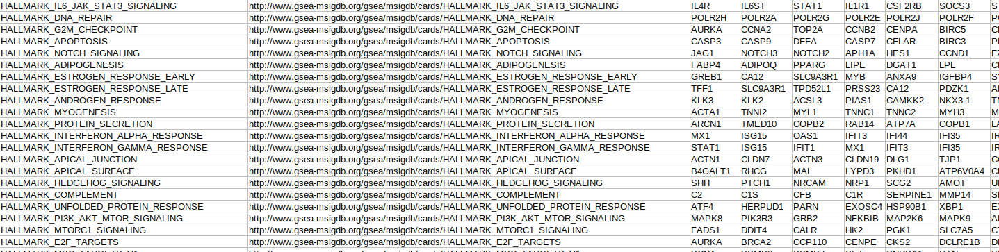
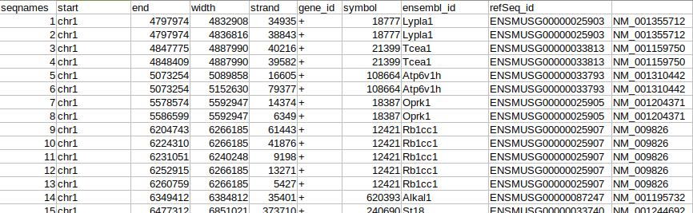

# ChroKit
ChroKit (The **Chro**matin Tool**Kit**) is a Shiny-based framework for interactive analysis, visualization and integration of genomic data.

This bioinformatics tool can help the researchers to process the data from next generation sequencing (NGS) experiments, such as Chip-Seq, ATAC-Seq and any other NGS experiments aimed at analyzing the enrichment of specific genomic features in particular regions of interest. 

As input, ChroKit takes aligned reads (BAM or WIG files), genomic ranges (BED or GTF/GFF formats) and lists of genes and performs several operations on them, such as the refinement of ranges boundaries, extraction of sequence patterns, gene ontologies on the annotated genes and the calculation of reads enrichment. The user can then perform logical operations on the genomic regions and unsupervised clustering to create further subsets of regions.
The wide variety of interactive plots offered by ChroKit can be modified simply by playing with mouse cursor and downloaded as pdf files. Working sessions can be exported as RDS files, allowing data sharing and reproducibility of the analyses. NOTE: the GIF below highlights some of the key features of Chrokit:


# Requirements
ChroKit is multiplatform and can run on any operating system (Windows, MacOS, Linux). At least 8 Gb of RAM are recommended. 
The program has been successfully tested on MacOS 10.14.6 Mojave, Linux Ubuntu Mate 20.04 and Windows 10; however, other versions of these operating systems should be supported as well.

# Installation from Docker image (recommended)
The Docker image of ChroKit has pre-installed libraries of the human and mouse genome assemblies. Before you start with the installation, be sure to have Docker installed and running (activated) on your system.


### **Installation for MacOS and Linux users**

1. Install and open the Docker desktop app. Docker desktop can be downloaded from https://www.docker.com/products/docker-desktop/.
\
(If the most recent Docker app is not compatible with your operating system, try to download and install one of the previous Docker releases, according to the version of your operating system at that link: https://docs.docker.com/desktop/release-notes/ or that link: https://docs.docker.com/desktop/previous-versions/archive-mac/)


2. Open the terminal application (in a Mac operating system the terminal application is generally found in HD/applications/utilities)


3. To pull the docker image, type the following command into the terminal window:\
\
```sudo docker pull ocroci/chrokit:latest```\
\
and press enter. When prompted, insert the computer administration password and press enter. (note that when you enter the password the command line cursor will not move and the password will not show). **Wait until the image is downloaded**.


4. Make sure to give enough resources to Docker if you plan to use heavy datasets. In the Docker desktop app, open the settings and go to "resources". Give at least 4-8 Gb of memory (RAM) to Docker to avoid crashes of the program when using heavy datasets. (for futher instructions, please follow the Docker documentation at https://docs.docker.com/desktop/settings/mac/)


5. To run the program, insert your "home directory" path and the port number in the command shown below. When using ChroKit, you will find the computer files in the "/mnt" folder:\
\
```sudo docker run -v <home directory>:/mnt/ -p <port>:6060 -it ocroci/chrokit:latest```\
\
In the previous command you have to:\
substitute **\<home directory\>** with the path of the home directory of the user. Usually, it is "/home/*username*" in Linux or "/Users/*username*" in MacOS systems.\
(In UNIX systems, the home directory can be found with the *pwd* command from terminal.)\
Substitute **\<port\>** by choosing a number between 1025 and 60000.
\
(This number indicates an arbitrary port on the host system (your computer) used for accessing the docker image: it must be free and not used by other programs. If you experience problems, try another number). \
For example, in MacOS, in the following command line "/Users/ocroci" is the home directory and 4000 is the port:\
\
```sudo docker run -v /Users/ocroci/:/mnt/ -p 4000:6060 -it ocroci/chrokit:latest```\
\
Insert the command in the terminal and press enter. If required, type the password as you did in step (3.). **Wait for ChroKit initialization**

6. To use the application, open a web browser and:
  - if you are using a personal computer, type the following in the address bar:\
  \
    ```127.0.0.1:<port>```\
  \
    In \<port\> you have to insert the port number selected in (4.).
    In the example above, the address will be:\
  \
    ```127.0.0.1:4000```\
  \
  since we used "4000" for the \<port\>. 
  - if you are using a remote machine, go to:\
  \
    ```<IP>:<port> ```\
  \
    where \<IP\> is the IP address of the remote machine in which the Docker container is running and the \<port\> is the port selected when running the image.
    
**Note for MacOS users**: make sure that the computer does NOT disconnect from network when it goes into sleeping, otherwise ChroKit will interrupt its execution. To prevent this go to system preferences/energy savings options and tick the checkbox "Prevent computer sleeping automatically when the display is off".

For further help to install the Docker image of ChroKit in Mac OS, please follow this video clip:


From now on, to use the application, follow again all the steps except step (3.).


### **Installation for Windows users**

1.  Install and open the Docker desktop app. Docker desktop can be downloaded from https://www.docker.com/products/docker-desktop/.
\
(If the most recent Docker app is not compatible with your operating system, try to download and install one of the previous Docker releases, according to the version of your operating system at that link: https://docs.docker.com/desktop/release-notes/ or that link: https://docs.docker.com/desktop/previous-versions/archive-mac/)
 

2. Open the command prompt (search for "CMD" application in Windows)


3. To pull the docker image, type the following command into the prompt window:\
\
```docker pull ocroci/chrokit:latest```\
\
and press enter. **Wait until the image is downloaded**. (Optionally, you should be able to download the image from within the Docker desktop app)


4. To run the program, go to the Docker desktop application and run the downloaded image. In the settings, select a name for the container (i.e. chrokit), choose a port (i.e. 4000) and a volume path (for example, select the home directory in C:\Users\\_username_) and a container path (type "/mnt"). Then, run the image and **wait for ChroKit initialization**. 
Note: the port must not be in use by other programs; if you experience problems, try another number.\
In this case use "/mnt" folder when using ChroKit to find all the files in the computer.\
Make sure to give enough RAM to the container if you plan to use heavy datasets. Go to the settings, then "resources" and increase the memory (RAM) up to 4-8 Gb.


5. To use the application, open a web browser and:
  - if you are using a personal computer, type the following in the address bar:\
  \
    ```127.0.0.1:<port>```\
  \
    In \<port\> you have to insert the port number selected in (4.).
    In the example above, the address will be:\
  \
    ```127.0.0.1:4000```\
  \
  since we used "4000" for the port. 
  - if you are using a remote machine, go to:\
  \
    ```<IP>:<port> ```\
  \
    where \<IP\> is the IP address of the remote machine in which the Docker container is running and the \<port\> is the port selected when running the image.

From now on, to use the application, follow again all the steps except step (3.).

For further help to install the Docker image of ChroKit in Windows, please follow this video clip:


# Installation from source (using R interpreter)

### Install dependencies 
1) Download and install the R interpreter (suggested version 3.5 or higher) on your computer or on a remote machine
2) Download the ChroKit source code in this gitHub page. Unzip the folder if necessary 
3) Make sure the OS-specific requirements are satisfied:

- ***Linux users***:
  For Linux users, make sure to install the required system packages; this can be done from a terminal with the following command:\
  ```sudo apt install libcurl4-openssl-dev libxml2-dev libssl-dev libz-dev```\
  In case of further errors, try to follow the suggestions at the beginning of the *installChrokitDependencies.R* script.*


- ***MacOS users***:
  To run ChroKit from within R in a MacOS machine, make sure the Xcode command line tools are properly installed and updated.
  This could be done by simply typing the following command on a terminal:
  ```xcode-select --install``` 
  
  Note: while sleeping, the computer must NOT disconnect from network, otherwise Chrokit will interrupt its execution. This behaviour can be set in the energy savings options (usually you must check the "Prevent computer sleeping automatically when the display is off").


- ***Windows users***:
  Make sure to install the R interpreter in a directory path without spaces: when prompted the path for installation choose C:\R\ as the path.
  After installing the R interpreter, install Rtools; then, modify the PATH variable to include also all the binaries of Rtools.
  To install Rtools and modify the PATH variable, follow the instructions at the link: https://cran.r-project.org/bin/windows/Rtools/.
  Note for windows users: only BAM file association is allowed (WIG files not supported); moreover, only one core is allowed, due to the use of “parallel”  library, which works only on UNIX operating systems.*


4) Open the R interpreter and go to the main source directory of the program; type:\
 ```setwd("/path/to/the/ChroKit/folder/source")```\
  where "/path/to/the/ChroKit/folder/source" is the path on the system in which installChrokitDependencies.R and shinyapp.R scripts are located. For example, if the ChroKit source code has been downloaded in "/Users/ocroci/Downloads" directory, just type:\
  ```setwd("/Users/ocroci/Downloads/ChroKit-master/source/")```\
  in the R console.
5) Run the script and wait for all dependencies to be downloaded from internet, by typing the following command in the R console:\
 ```source ("installChrokitDependencies.R")```
 
 
 Alternatively, make sure the following R libraries are installed:
  - shiny
  - shinyFiles
  - shinydashboard
  - shinyWidgets
  - fastcluster
  - VennDiagram
  - GenomicRanges
  - rtracklayer
  - data.table
  - RColorBrewer
  - Rsamtools
  - ppcor
  - Rcpp
  - bamsignals
  - qs
  - parallel
  - pryr
  
  
If you have problems when installing dependencies, try to install each package from source:
1) Download the package in .tar.gz compressed format from internet
2) From R session, install the package from source. For example, for "rtracklayer" version 1.58 package:
```install.packages("rtracklayer_1.58.0.tar.gz", repos = NULL, type="source")```


### Basic setup (optional)
Some parameters could be set in the **shinyapp.r** script, such as the listening port or the number of cores, as well as the colors available for the heatmaps.
- The variable **Port** specifies the listening port of the program. Default: 6060.
- The variable **nc** specifies the number of cores that will be used for computation. The higher the number, the faster the program will be, but it will require more RAM. Windows users will always use 1 single core for operations because of technical issues.
- The variable **RAM_system** specifies the amount of RAM available on the system in Gb. Recommended: 4.
- The variable **ColsArray** specifies all colors available in the palettes for heatmaps (gradient from white)


### Use custom gene signatures for gene ontology (optional for advanced users)
To add new gene signatures for gene ontology analyses, you must upload their gmt files in the source/appContent/signatures/ folder of the program before launching the app. The GMT format is a tab-delimited text file. Each row has a variable amount of columns, depending on the genes. The first column is the name of the signature, the second column can contain arbitrary information (in the example below, the link to the source) and from the 3rd column, all the gene symbols for that specific signature.



File names of the signatures must end with **\_symbols.gmt**.
Custom .gmt files can be added and used only when running ChroKit from the R command line (this option is not supported in the Docker version).


### Use custom genome assemblies (optional for advanced users)
Custom genome assemblies can be added in the source/appContent/assemblies/ folder of the program before launching the app, where all the standard genomes are stored.
To use the "xxxx" custom genome assembly, prepare a tab-delimited text file with the following format:



which contains the information about the coordinates of the annotated transcripts and gene IDs and symbol for each transcript. This format must match that of the standard genomes already present in the folder (for example, refer to "mm9" file). Rename the file "xxxx" and move it into the folder. ChroKit will find it and show as one of the assemblies available.
Custom genome assemblies can be used only when running ChroKit from the R command line (this option is not supported in the Docker version). 
Please note: Pattern search for custom genome assemblies is not supported.


### Launch the program
Launch the application by typing the following command in the R console (make sure you are in the directory in which ChroKit source code was installed):\
  ```source("shinyapp.r")```

When you see the message "Listening on http://0.0.0.0:6060" in the R console, it means the application is running properly. Open the application using your web browser, by typing:\
    ```127.0.0.1:6060```\
in the address bar. If you installed ChroKit on a remote machine, type:
    ```<IP>:6060 ```\
in the address bar of the browser, where \<IP\> is the IP address of the remote machine, and 6060 is the listening port used by ChroKit.


### Tips
To reset/refresh a working session, please reload the webpage in the browser.\
If you experience "Figure margins too large" error in plots, please change the zoom of the web page of the browser.\
The use on smartphones is limited by screen size which at time renders visualization of widgets not optimal. Also, the point and drag operations in the Enrichment-based Heatmaps cannot be performed from a smartphone.


# Tutorial
To learn the basics on how to analyse NGS data with ChroKit, please follow the tutorials at this page: https://ocroci.github.io/ChroKit/ using sample data.


# Credits
- The function for drawing color bars was adapted from John Colby (stackoverflow) http://stackoverflow.com/questions/9314658/colorbar-from-custom-colorramppalette
- The function to generate a number of most distinctive colors in R was taken from http://stackoverflow.com/questions/15282580/how-to-generate-a-number-of-most-distinctive-colors-in-r (Megatron)
- "distanceFromTSS3", "countOverlapsInBins", "GRbaseCoverage2" and "summitFromBaseCoverage" functions were taken (or adapted) from the compEpiTools R package:\
**Kishore K, de Pretis S, Lister R, Morelli MJ, Bianchi V, Amati B, Ecker JR, Pelizzola M (2015). “methylPipe and compEpiTools: a suite of R packages for the integrative analysis of epigenomics data.” BMC Bioinformatics. doi: 10.1186/s12859-015-0742-6.**
- Pre-loaded genesets for gene ontology analyses were downloaded from MSigDB v.7.4 (copyright (c) 2004-2020 Broad Institute, Inc., Massachusetts Institute of Technology, and Regents of the University of California) (http://www.gsea-msigdb.org/gsea/downloads.jsp) and are under Creative Commons Attribution 4.0 International License (https://creativecommons.org/licenses/by/4.0/legalcode)


# Citation
If you use this framework for your project, please cite the following paper:\
\
**Ottavio Croci, Stefano Campaner, ChroKit: a Shiny-based framework for interactive analysis, visualization and integration of genomic data, Nucleic Acids Research, 2023;, gkad345, https://doi.org/10.1093/nar/gkad345**


# License
Copyright (c) 2020 Ottavio Croci\
[The GNU GENERAL PUBLIC LICENSE v3.0](LICENSE)

